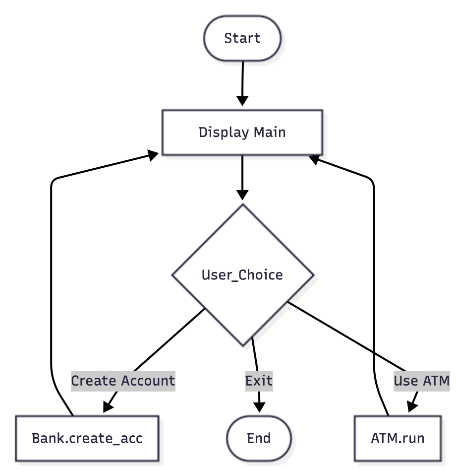
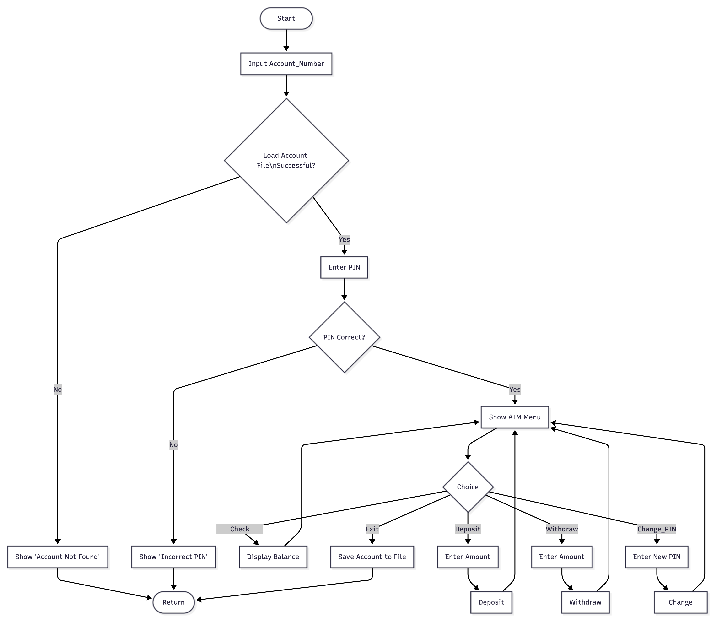
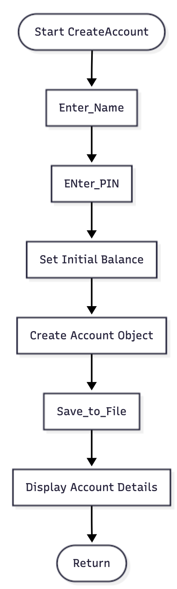

███████╗████████╗███╗   ███╗      ███████╗██╗███╗   ███╗██╗██╗     ███████╗
██╔════╝╚══██╔══╝████╗ ████║      ██╔════╝██║████╗ ████║██║██║     ██╔════╝
███████╗   ██║   ██╔████╔██║█████╗█████╗  ██║██╔████╔██║██║██║     █████╗  
╚════██║   ██║   ██║╚██╔╝██║╚════╝██╔══╝  ██║██║╚██╔╝██║██║██║     ██╔══╝  
███████║   ██║   ██║ ╚═╝ ██║      ██║     ██║██║ ╚═╝ ██║██║███████╗███████╗
╚══════╝   ╚═╝   ╚═╝     ╚═╝      ╚═╝     ╚═╝╚═╝     ╚═╝╚═╝╚══════╝╚══════╝

                         ATM SIMULATOR (OOPS PROJECT)

# ATM_Simulator-OOPS_Project

This project is a simple ATM Simulator built using C++. It allows users to perform basic banking operations such as checking balance, depositing money, withdrawing money, and verifying PIN authentication. The program demonstrates the use of object-oriented programming, encapsulation, and menu-driven interaction in a console environment.
# Features
* Secure PIN Verification
* Deposit Money
* Withdraw Money with Balance Validation
* Check Account Balance
* Menu-Driven User Interface
* Object-Oriented Design (Classes, Objects, Constructors)
* Clean and Modular Code Structure

## Flowchart
* Main Function

* For ATM_Simulation 

* For Bank

