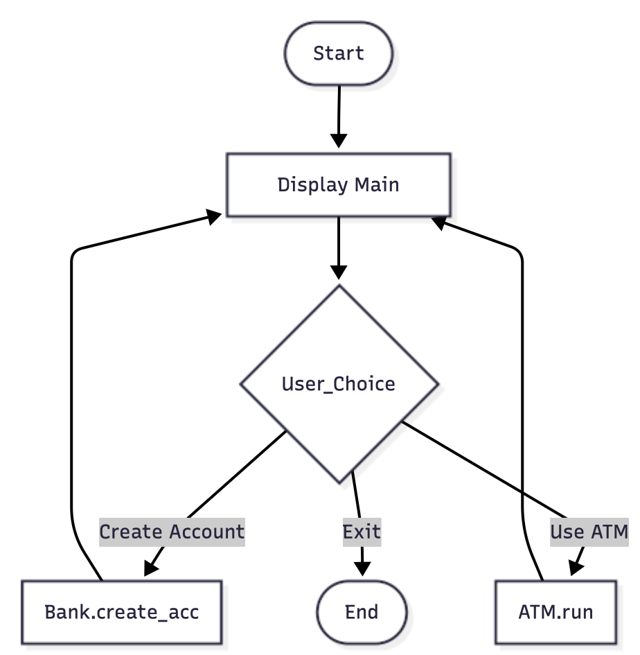
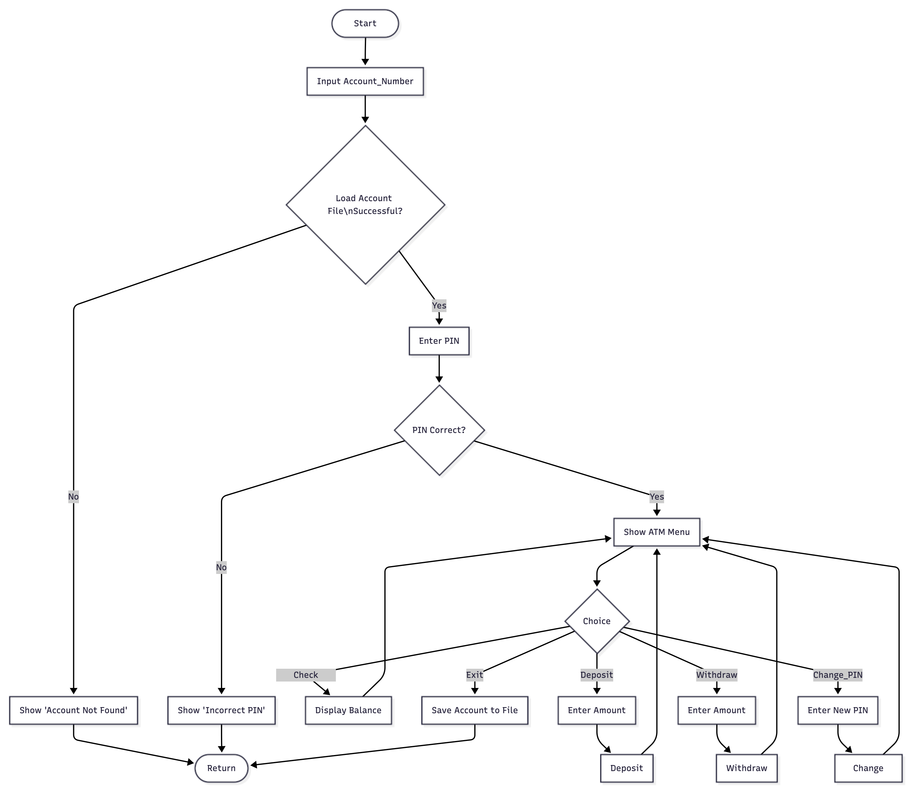
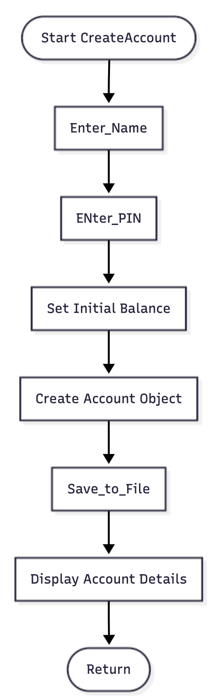

# 🏧 ATM Simulator — C++ OOP Project

> A console-based ATM and banking system built in C++ demonstrating core Object-Oriented Programming principles — encapsulation, classes, constructors, and file I/O for persistent account storage.

[](https://isocpp.org/)
[](https://en.wikipedia.org/wiki/Object-oriented_programming)
[](https://gcc.gnu.org/)

---

## 🎯 What This Project Does

A fully functional ATM Simulator that models real banking workflows through a menu-driven console interface. Demonstrates clean OOP design with three cooperating classes, secure PIN authentication, and persistent account data stored across sessions using file I/O.

---

## ✨ Features

- 🔐 **PIN-based authentication** — secure login before any transaction
- 🏦 **Account creation** — Bank class creates and persists new accounts
- 💰 **Deposit** — add funds with input validation
- 💸 **Withdrawal** — deduct funds with insufficient balance protection
- 📊 **Balance inquiry** — check current balance instantly
- 🔑 **PIN change** — update PIN securely mid-session
- 💾 **Persistent storage** — account data saved to `.txt` files and reloaded across sessions
- ✅ **Input validation** — handles invalid amounts and incorrect PINs gracefully
- 📋 **Menu-driven UI** — clean, looping console interface

---

## 🏗️ OOP Design

The project is built around **3 well-defined classes** that model real-world banking entities:

```
┌─────────────────────────────────────────────────────┐
│                    Account Class                    │
│  - acc_holder_name, account_num, pin, balance       │
│  - Static counter: next_acc_num (starts at 101)     │
│  + deposit(), withdraw(), authenticate()            │
│  + getBalance(), changePin(), display()             │
│  + saveToFile(), loadFromFile()   ← File I/O        │
└──────────────────────┬──────────────────────────────┘
                       │ uses
          ┌────────────┴────────────┐
          │                         │
┌─────────▼──────────┐   ┌─────────▼──────────┐
│     Bank Class     │   │      ATM Class      │
│  + create_acc()    │   │  + run()            │
│    Creates Account │   │    Loads account    │
│    Saves to file   │   │    Authenticates    │
└────────────────────┘   │    Runs menu loop   │
                         └─────────────────────┘
```

### OOP Concepts Demonstrated

| Concept | Where Used |
|---------|-----------|
| **Classes & Objects** | `Account`, `Bank`, `ATM` — each models a real entity |
| **Encapsulation** | `private` fields in `Account`; accessed only via `public` methods |
| **Constructors** | Default constructor + parameterized constructor in `Account` |
| **Static members** | `next_acc_num` auto-increments account numbers (starts at 101) |
| **File I/O** | `saveToFile()` / `loadFromFile()` — persistence across program runs |
| **Input Validation** | Deposit/withdrawal checks; PIN mismatch handling |
| **Separation of Concerns** | `Bank` creates accounts; `ATM` handles transactions |

---

## 🗂️ Project Structure

```
ATM_Simulator-OOPS_Project/
├── ATM_Simulator.cpp    ← Full source code (223 lines)
├── ATM_flowchart.png    ← ATM class flowchart
├── Bank_flowchart.png   ← Bank class flowchart
├── main.png             ← Main function flowchart
└── README.md
```

> Account data is stored as `<account_number>.txt` files (e.g., `101.txt`) created at runtime in the working directory.

---

## 📊 Flowcharts

**Main Function Flow**



**ATM Class Flow**



**Bank Class Flow**



---

## ⚡ How to Compile & Run

### Prerequisites
- Any C++ compiler: **GCC**, **Clang**, or **MSVC**
- C++11 or newer

### Compile with GCC
```bash
g++ ATM_Simulator.cpp -o atm_simulator
```

### Run
```bash
./atm_simulator        # Linux / Mac
atm_simulator.exe      # Windows
```

---

## 🖥️ Sample Session

```
--------- MENU ---------
1. Create Account
2. Use ATM
3. Exit
Choose option: 1

Enter Customer's name: Kunal
Enter Pin: 1234
Set Initial Balance: 5000
-----Account Created-----
Account Holder's name: Kunal
Account Number: 101
Current balance: 5000

--------- MENU ---------
Choose option: 2

Enter Account Number: 101
Enter PIN: 1234

--------- MENU ---------
1. Check Balance
2. Deposit
3. Withdraw
4. Change PIN
5. Exit
Choose option: 2

Enter deposit amount: 2000
Amount deposited successfully.

Choose option: 1
Current balance: 7000

Choose option: 5
Transaction complete. Thank you!
```

---

## 🧠 Key Implementation Details

### Static Account Numbering
```cpp
static int next_acc_num;          // shared across all Account objects
account_num = ++next_acc_num;     // auto-increments from 101
```

### File Persistence
Each account is saved to a uniquely named `.txt` file, reloaded on next login:
```cpp
void saveToFile() {
    ofstream file(to_string(account_num) + ".txt");
    file << account_num << endl << pin << endl << balance;
}
```

### PIN Authentication
```cpp
bool aunthication(int P) {
    return pin == P;    // true only if PIN matches
}
```

### Balance Validation
```cpp
void withdraw(float amount) {
    if (amount <= 0)           cout << "Invalid amount.\n";
    else if (amount > balance) cout << "Insufficient Funds.\n";
    else balance -= amount;
}
```

---

## 🗺️ Possible Extensions

- [ ] Multi-account support using `vector<Account>`
- [ ] Transaction history log appended to file per session
- [ ] Interest calculation for savings accounts
- [ ] Account-to-account transfer
- [ ] Masked PIN input using `getch()`
- [ ] SQLite database instead of flat `.txt` files

---

## 📚 About

Built as an academic OOP project to demonstrate class design, encapsulation, and file handling in C++.

> Developed by [Kunal Yadav](https://github.com/kunal9812) — B.Tech Computer Science, Manav Rachna University

---

## 🤝 Connect

- 💼 [LinkedIn](https://www.linkedin.com/in/kunal-yadav-ba4510364/)
- 🐙 [GitHub](https://github.com/kunal9812)
- 📧 kunalyadav49101@gmail.com

---

## ⭐ If this helped you understand OOP in C++, consider starring the repo!
